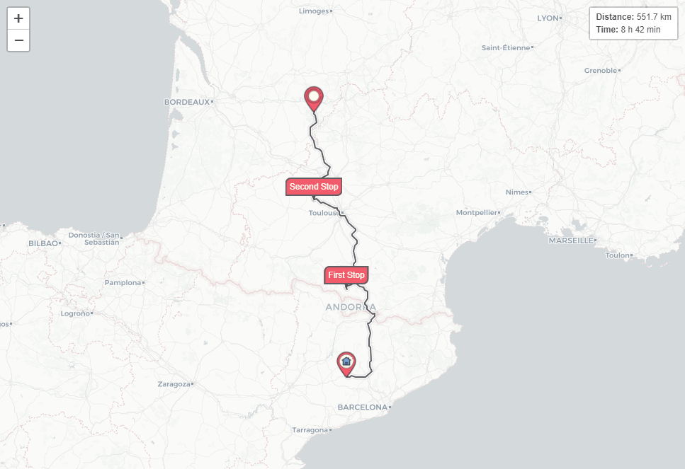

# react-leaflet-waypoints
React component to show waypoints on Leaflet's map.



# Installation
Install `react-leaflet-waypoints` with [npm](https://www.npmjs.com/):

`npm install react-leaflet-waypoints`  
or  
`yarn add react-leaflet-waypoints`

# Demo
At the moment there is no live demo, but you can easily check the Storybook in your local.

Clone the repository and move into:
```
git clone git@github.com:ozaytsev86/react-leaflet-waypoints.git
cd react-leaflet-waypoints
```

Install dependencies:
```
yarn / npm install
```

Run Storybook
```
yarn sb / npm run sb
```

# Roadmap
- Make it work in another project importing it as a library. Take a look on [react-leaflet-waypoints-test](https://github.com/ozaytsev86/react-leaflet-waypoints-test)  
- Finish all the tests  
- Publish the package in npm

# Issues
If you found an issue, or you have a suggestion please create a ticket [here](https://github.com/ozaytsev86/react-leaflet-waypoints/issues)

# Contributions
Create or take an already created issue  
Clone the repository  
Create a branch with the issue name  
Once you finish create a pull request  

# License
[MIT](https://opensource.org/licenses/MIT)